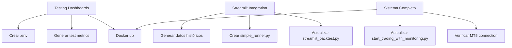

# 🔍 Análisis de Pain Points - Sistema UNDERDOG

**Fecha**: 20 de Octubre 2025  
**Fase Actual**: 4.2 - Prometheus Instrumentation COMPLETE  
**Contexto**: Preparando testing de dashboards + conexión de Streamlit

---

## 📋 Pain Points Identificados

### 🔴 **CRÍTICO 1: No hay datos históricos para backtesting**

**Problema**:
- `data/historical/` está **VACÍO** (0 archivos)
- Streamlit usa **dummy data** (generado aleatoriamente)
- No se pueden realizar backtests reales

**Impacto**:
- ❌ Backtesting UI no funcional
- ❌ No se puede validar performance de EAs
- ❌ No se puede optimizar parámetros

**Solución Propuesta**:
```python
# Opción A (RÁPIDA): Generar datos sintéticos para testing
# - Generar 1 año de datos EURUSD M15 con statsmodels
# - Características: tendencia + volatilidad + estacionalidad
# - Tiempo: ~10 minutos

# Opción B (MEJOR): Descargar datos reales de HistData.com
# - Descarga manual de CSV desde: https://www.histdata.com/
# - Usar histdata_ingestion.py para convertir a OHLCV
# - Tiempo: ~30 minutos (manual)

# Opción C (IDEAL): Conectar a MT5 y descargar histórico
# - Requiere cuenta MT5 activa
# - Usar mt5_connector.py
# - Tiempo: ~15 minutos
```

**Prioridad**: 🔴 **ALTA** (bloqueante para Streamlit integration)

---

### 🟠 **MEDIO 1: start_trading_with_monitoring.py solo instrumenta 1 EA**

**Problema**:
```python
# Línea 47: Solo importa SuperTrendRSI
from underdog.strategies.ea_supertrend_rsi_v4 import FxSuperTrendRSI, SuperTrendRSIConfig
# TODO: Import other 6 EAs when instrumented

# Línea 60: Solo configura 1 EA
EAS_CONFIG = [
    {
        "ea_class": FxSuperTrendRSI,
        "config": SuperTrendRSIConfig(...),
        "name": "SuperTrendRSI"
    },
    # TODO: Add other 6 EAs
]
```

**Impacto**:
- ⚠️ Los dashboards de Grafana mostrarán métricas solo para 1 EA
- ⚠️ No se pueden comparar performances entre EAs
- ⚠️ Prometheus metrics incompletos

**Solución Propuesta**:
```python
# Importar los 7 EAs instrumentados
from underdog.strategies.ea_supertrend_rsi_v4 import FxSuperTrendRSI, SuperTrendRSIConfig
from underdog.strategies.ea_parabolic_ema_v4 import FxParabolicEMA, ParabolicEMAConfig
from underdog.strategies.ea_keltner_breakout_v4 import FxKeltnerBreakout, KeltnerBreakoutConfig
from underdog.strategies.ea_ema_scalper_v4 import FxEmaScalper, EmaScalperConfig
from underdog.strategies.ea_bollinger_cci_v4 import FxBollingerCCI, BollingerCCIConfig
from underdog.strategies.ea_atr_breakout_v4 import FxATRBreakout, ATRBreakoutConfig
from underdog.strategies.ea_pair_arbitrage_v4 import FxPairArbitrage, PairArbitrageConfig

# Configurar 7 EAs en EAS_CONFIG con diferentes símbolos/timeframes
```

**Prioridad**: 🟠 **MEDIA** (importante para demostración completa)

---

### 🟠 **MEDIO 2: EventDrivenBacktest no tiene wrapper simple**

**Problema**:
- `event_driven.py` tiene clase completa pero requiere formato de datos específico
- Streamlit necesita función simple: `run_backtest(ea, params, data) → results`
- No hay punto de integración claro

**Solución Propuesta**:
```python
# Crear: underdog/backtesting/simple_runner.py
def run_simple_backtest(
    ea_class,
    ea_config,
    ohlcv_data: pd.DataFrame,
    initial_capital: float = 100000
) -> Dict[str, Any]:
    """
    Simple wrapper for Streamlit integration.
    
    Args:
        ea_class: EA class (e.g., FxSuperTrendRSI)
        ea_config: EA config instance
        ohlcv_data: DataFrame with OHLCV + timestamp
        initial_capital: Starting capital
    
    Returns:
        Dict with: equity_curve, trades, metrics, drawdown
    """
    # 1. Convert OHLCV to tick format (bid/ask from close ± spread)
    # 2. Create strategy wrapper
    # 3. Run EventDrivenBacktest
    # 4. Return formatted results for Streamlit
```

**Prioridad**: 🟠 **MEDIA** (necesario para Streamlit, pero se puede hacer rápido)

---

### 🟡 **BAJO 1: Docker compose requiere archivo .env**

**Problema**:
```yaml
# docker-compose.yml línea 12
env_file:
  - .env

# Línea 18-19
environment:
  - DB_HOST=timescaledb
  - DB_PASSWORD=${DB_PASSWORD:?DB_PASSWORD is required}
  - GRAFANA_PASSWORD=${GRAFANA_PASSWORD:?GRAFANA_PASSWORD is required}
```

- No existe archivo `.env` en el proyecto
- Docker compose fallará al iniciar

**Solución Propuesta**:
```bash
# Crear docker/.env
DB_USER=underdog
DB_PASSWORD=underdog_trading_2024_secure
DB_NAME=underdog_trading
GRAFANA_USER=admin
GRAFANA_PASSWORD=admin123
```

**Prioridad**: 🟡 **BAJA** (fácil de crear, pero crítico para Docker)

---

### 🟡 **BAJO 2: Drawdown calculation es dummy**

**Problema**:
```python
# start_trading_with_monitoring.py línea 94-96
# TODO: Implement proper DD calculation from peak
daily_dd_pct = -1.5  # Dummy
total_dd_pct = -3.2  # Dummy
```

**Impacto**:
- Métricas de riesgo en Grafana serán falsas
- No se pueden activar alertas basadas en DD real

**Solución Propuesta**:
```python
# Implementar cálculo real basado en equity_curve
def calculate_drawdown(account_info, equity_history):
    current_equity = account_info.equity
    peak_equity = max(equity_history)
    
    daily_dd_pct = ((current_equity - equity_history[-1]) / equity_history[-1]) * 100
    total_dd_pct = ((current_equity - peak_equity) / peak_equity) * 100
    
    return daily_dd_pct, total_dd_pct
```

**Prioridad**: 🟡 **BAJA** (no bloqueante, pero importante para producción)

---

### 🟡 **BAJO 3: No hay script para generar datos de prueba**

**Problema**:
- Para testing de dashboards necesitamos métricas **ahora mismo**
- No queremos esperar señales reales de EAs (puede tardar horas/días)
- No hay generador de datos sintéticos para Prometheus

**Solución Propuesta**:
```python
# Crear: scripts/generate_test_metrics.py
# - Simula 7 EAs generando señales random
# - Actualiza Prometheus metrics cada 1 segundo
# - Genera trades, P&L, drawdown sintéticos
# - Permite testar dashboards inmediatamente
```

**Prioridad**: 🟡 **BAJA** (útil para testing, pero no crítico)

---

## 🎯 Plan de Acción Recomendado

### **Workflow 1: Testing Rápido de Dashboards** (15 minutos)

```bash
# 1. Crear archivo .env
cd docker
echo "DB_PASSWORD=underdog123" > .env
echo "GRAFANA_PASSWORD=admin123" >> .env

# 2. Generar métricas de prueba
poetry run python scripts/generate_test_metrics.py &

# 3. Lanzar Docker services
docker-compose up -d prometheus grafana

# 4. Verificar dashboards
# - Prometheus: http://localhost:9090
# - Grafana: http://localhost:3000 (admin/admin123)
```

**Resultado**: Dashboards funcionando con datos sintéticos

---

### **Workflow 2: Conectar Streamlit con Backtesting Real** (45 minutos)

```bash
# 1. Generar datos históricos sintéticos
poetry run python scripts/generate_synthetic_data.py \
    --symbol EURUSD \
    --timeframe M15 \
    --start-date 2023-01-01 \
    --end-date 2024-10-20 \
    --output data/historical/

# 2. Crear wrapper simple
# - Implementar underdog/backtesting/simple_runner.py

# 3. Actualizar Streamlit
# - Reemplazar dummy data con real backtest
# - Conectar botón "Run Backtest" a simple_runner

# 4. Probar
poetry run streamlit run underdog/ui/streamlit_backtest.py
```

**Resultado**: Streamlit funcionando con backtests reales

---

### **Workflow 3: Sistema Completo con 7 EAs** (30 minutos)

```bash
# 1. Actualizar start_trading_with_monitoring.py
# - Importar 7 EAs
# - Configurar EAS_CONFIG con 7 estrategias

# 2. Lanzar sistema completo
poetry run python scripts/start_trading_with_monitoring.py &

# 3. Verificar métricas
curl http://localhost:8000/metrics | grep ea_status

# 4. Ver dashboards en Grafana
# - Portfolio Overview: cuenta general
# - EA Performance Matrix: 7 EAs con métricas
# - Open Positions: posiciones actuales
```

**Resultado**: Sistema completo monitoreando 7 EAs en tiempo real

---

## 📊 Resumen de Dependencias



---

## ✅ Checklist de Tareas

### Fase 1: Testing Dashboards (AHORA)
- [ ] Crear `docker/.env` con passwords
- [ ] Crear `scripts/generate_test_metrics.py` para datos sintéticos
- [ ] Lanzar Docker Prometheus + Grafana
- [ ] Verificar 3 dashboards en Grafana

### Fase 2: Streamlit Integration (PARALELO)
- [ ] Crear `scripts/generate_synthetic_data.py` para OHLCV histórico
- [ ] Crear `underdog/backtesting/simple_runner.py` wrapper
- [ ] Actualizar `streamlit_backtest.py` con real backtesting
- [ ] Probar Streamlit UI end-to-end

### Fase 3: Sistema Completo (DESPUÉS)
- [ ] Actualizar `start_trading_with_monitoring.py` con 7 EAs
- [ ] Implementar cálculo real de drawdown
- [ ] Testing end-to-end con MT5 (opcional)
- [ ] Documentar resultados

---

## 🚀 Siguiente Paso Inmediato

**RECOMENDACIÓN**: Ejecutar **Workflow 1 + Workflow 2 en paralelo**

**Razón**: 
- Workflow 1 (dashboards) es independiente y rápido
- Workflow 2 (Streamlit) toma más tiempo pero es crítico
- Ambos se pueden hacer simultáneamente

**Tiempo Estimado Total**: 1 hora

**Pregunta para el usuario**:
> ¿Empezamos con ambos workflows en paralelo? Primero creo los archivos necesarios (`.env`, `generate_test_metrics.py`, `generate_synthetic_data.py`, `simple_runner.py`) y luego ejecutamos todo paso a paso.

