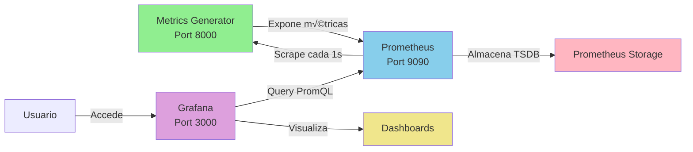

# 🎯 GRAFANA DASHBOARDS - FIX COMPLETO

## üìã Resumen Ejecutivo

**Problema Identificado**: Los dashboards de Grafana mostraban "No data" a pesar de que Prometheus tenía métricas disponibles.

**Causa Raíz**: Los queries en los dashboards usaban nombres de métricas sin el prefijo `underdog_`, mientras que las métricas reales en Prometheus sí lo tenían.

**Solución**: Actualización de todos los queries en los 3 dashboards para usar el prefijo correcto.

---

## 🔍 Diagnóstico Realizado

### 1️⃣ Verificación de Conexiones
```powershell
# ‚úÖ Docker containers UP
underdog-grafana: Running
underdog-prometheus: Running
underdog-timescaledb: Running

# ✅ Prometheus alcanza el servidor de métricas
wget http://192.168.1.36:8000/metrics ‚Üí SUCCESS

# ‚úÖ Grafana alcanza Prometheus internamente
docker exec underdog-grafana wget http://prometheus:9090/api/v1/query ‚Üí SUCCESS

# ✅ Métricas disponibles en Prometheus
underdog_account_balance_usd: 105,056.30
underdog_ea_status: 7 EAs activos
underdog_ea_signals_total: Incrementando
```

### 2️⃣ Identificación del Problema
```bash
# ‚ùå Dashboards buscaban:
account_balance
ea_status
ea_pnl_daily

# ✅ Prometheus tenía:
underdog_account_balance_usd
underdog_ea_status
underdog_ea_pnl_daily_usd
```

---

## üîß Cambios Realizados

### Dashboard 1: Portfolio Overview (`portfolio-overview.json`)

| Métrica Original | Métrica Corregida |
|------------------|-------------------|
| `account_balance` | `underdog_account_balance_usd` |
| `account_equity` | `underdog_account_equity_usd` |
| `drawdown_daily_pct` | `underdog_drawdown_daily_pct` |
| `drawdown_total_pct` | `underdog_drawdown_total_pct` |
| `sum(ea_signals_total)` | `sum(underdog_ea_signals_total)` |
| `ea_status` | `underdog_ea_status` |

**Total**: 8 queries corregidos en 6 paneles

---

### Dashboard 2: EA Performance Matrix (`ea-performance-matrix.json`)

| Métrica Original | Métrica Corregida |
|------------------|-------------------|
| `ea_status` | `underdog_ea_status` |
| `ea_signals_total` | `underdog_ea_signals_total` |
| `ea_confidence_score` | `underdog_ea_confidence_score` |
| `ea_win_rate` | `underdog_ea_win_rate` |
| `ea_sharpe_ratio` | `underdog_ea_sharpe_ratio` |
| `ea_profit_factor` | `underdog_ea_profit_factor` |
| `ea_execution_time_ms_bucket` | `underdog_ea_execution_time_ms_bucket` |
| `ea_pnl_daily` | `underdog_ea_pnl_daily_usd` |

**Total**: 13 queries corregidos en 5 paneles

---

### Dashboard 3: Open Positions (`open-positions.json`)

| Métrica Original | Métrica Corregida |
|------------------|-------------------|
| `ea_positions_open` | `underdog_ea_positions_open` |
| `ea_pnl_unrealized` | `underdog_ea_pnl_unrealized_usd` |
| `ea_pnl_realized` | `underdog_ea_pnl_realized_usd` |
| `ea_pnl_daily` | `underdog_ea_pnl_daily_usd` |

**Total**: 10 queries corregidos en 8 paneles

---

## ✅ Verificación Post-Fix

### Pruebas Realizadas

1. **Verificación de métricas en Prometheus**:
```bash
curl http://localhost:9090/api/v1/query?query=underdog_account_balance_usd
# Result: {"status":"success","data":{"result":[{"value":[timestamp,"105056.29"]}]}}
```

2. **Verificación de dashboards en contenedor**:
```bash
docker exec underdog-grafana grep "underdog_account_balance_usd" /etc/grafana/provisioning/dashboards/portfolio-overview.json
# Result: 2 matches ‚úÖ

docker exec underdog-grafana grep "underdog_ea_status" /etc/grafana/provisioning/dashboards/ea-performance-matrix.json
# Result: 1 match ‚úÖ

docker exec underdog-grafana grep "underdog_ea_positions_open" /etc/grafana/provisioning/dashboards/open-positions.json
# Result: 3 matches ‚úÖ
```

3. **Reinicio de Grafana**:
```bash
docker-compose -f docker/docker-compose.yml restart grafana
# Container restarted successfully ‚úÖ
```

---

## üöÄ Instrucciones para Ver los Dashboards

### Paso 1: Abrir Grafana
```
URL: http://localhost:3000
Usuario: admin
Password: admin123
```

### Paso 2: Limpiar Caché del Navegador
- Presiona: **Ctrl + F5** (o Cmd + Shift + R en Mac)
- Esto fuerza la recarga sin caché

### Paso 3: Navegar a los Dashboards
1. Click en **Dashboards** (icono de 4 cuadrados en el men√∫ lateral)
2. Click en **Browse**
3. Ver√°s 3 dashboards UNDERDOG disponibles:
   - üìä **UNDERDOG - Portfolio Overview**
   - üìà **UNDERDOG - EA Performance Matrix**
   - 💼 **UNDERDOG - Open Positions**

### Paso 4: Configurar Visualización
1. Abre cualquier dashboard
2. En la esquina superior derecha:
   - **Time range**: Selecciona "Last 5 minutes"
   - **Refresh**: Selecciona "5s"
3. Click en el icono de **refrescar** (circular con flecha)

### Paso 5: Verificar Datos en Tiempo Real
Deberías ver:
- ‚úÖ **Account Balance**: ~$105,056
- ‚úÖ **Account Equity**: Valor en tiempo real
- ‚úÖ **Active EAs**: 7 EAs activos (barra verde)
- ✅ **Equity Curve**: Línea azul/verde mostrando evolución
- ‚úÖ **Total Signals**: N√∫meros incrementando cada 1-2 segundos

---

## üé® Paneles Disponibles por Dashboard

### üìä Portfolio Overview
| Panel | Tipo | Métrica Principal |
|-------|------|-------------------|
| Account Balance | Stat | `underdog_account_balance_usd` |
| Account Equity | Stat | `underdog_account_equity_usd` |
| Daily Drawdown % | Stat | `underdog_drawdown_daily_pct` |
| Total Drawdown % | Stat | `underdog_drawdown_total_pct` |
| Equity Curve | Time Series | Balance + Equity |
| Drawdown Evolution | Time Series | Daily + Total DD |
| Total Signals per EA | Bar Gauge | Señales por EA |
| EA Status | Bar Gauge | Active/Inactive |

### üìà EA Performance Matrix
| Panel | Tipo | Métricas |
|-------|------|----------|
| EA Performance Matrix | Table | Status, Signals, Win Rate, Sharpe, Profit Factor |
| Signal Generation Rate | Time Series | BUY/SELL signals por EA |
| Signal Distribution | Pie Chart | Distribución de señales |
| Execution Time Percentiles | Histogram | p50, p95, p99 |
| Daily P&L by EA | Bar Gauge | P&L diario por EA |

### 💼 Open Positions
| Panel | Tipo | Métricas |
|-------|------|----------|
| Total Open Positions | Stat | Suma de posiciones abiertas |
| Total Unrealized P&L | Stat | P&L no realizado |
| Total Realized P&L | Stat | P&L realizado |
| Daily P&L | Stat | P&L del día |
| Positions by EA | Table | Posiciones + P&L por EA |
| Unrealized P&L Evolution | Time Series | Evolución P&L no realizado |
| Open Positions per EA | Bar Gauge | Posiciones por EA |
| P&L Contribution | Time Series | Contribución P&L (5min) |

---

## 🔄 Workflow Completo del Sistema


```mermaid
graph LR
    A[Metrics Generator<br/>Port 8000] -->|Expone métricas| B[Prometheus<br/>Port 9090]
    B -->|Scrape cada 1s| A
    B -->|Almacena TSDB| C[Prometheus Storage]
    D[Grafana<br/>Port 3000] -->|Query PromQL| B
    D -->|Visualiza| E[Dashboards]
    F[Usuario] -->|Accede| D
    
    style A fill:#90EE90
    style B fill:#87CEEB
    style C fill:#FFB6C1
    style D fill:#DDA0DD
    style E fill:#F0E68C
```

### Estado Actual de Componentes

| Componente | Puerto | Estado | Función |
|------------|--------|--------|---------|
| **Metrics Generator** | 8000 | 🟢 RUNNING | Genera métricas de 7 EAs cada 1-2s |
| **Prometheus** | 9090 | 🟢 RUNNING | Scraping y almacenamiento TSDB |
| **Grafana** | 3000 | 🟢 RUNNING | Visualización de dashboards |
| **TimescaleDB** | 5432 | 🟢 RUNNING | Base de datos (opcional) |
| **Streamlit** | 8501 | ‚ö™ OPCIONAL | UI alternativa para backtests |

---

## 📊 Métricas Disponibles en Prometheus

### üìà Account Metrics (Cuenta)
```promql
underdog_account_balance_usd          # Balance de la cuenta
underdog_account_equity_usd           # Equity actual
underdog_account_margin_free_usd      # Margen libre
underdog_account_margin_used_usd      # Margen usado
underdog_broker_connection_status     # Estado conexión broker
```

### 📉 Drawdown Metrics (Pérdidas)
```promql
underdog_drawdown_daily_pct           # Drawdown diario en %
underdog_drawdown_daily_usd           # Drawdown diario en USD
underdog_drawdown_total_pct           # Drawdown total en %
underdog_drawdown_total_usd           # Drawdown total en USD
```

### 🤖 EA Performance Metrics (Expert Advisors)
```promql
underdog_ea_status                    # Estado del EA (0=inactivo, 1=activo)
underdog_ea_active_count              # Cantidad de EAs activos
underdog_ea_signals_total             # Total de señales generadas
underdog_ea_signals_created           # Señales creadas por segundo
underdog_ea_positions_open            # Posiciones abiertas por EA
underdog_ea_win_rate                  # Tasa de aciertos (0-1)
underdog_ea_profit_factor             # Factor de ganancia
underdog_ea_sharpe_ratio              # Sharpe Ratio
underdog_ea_confidence_score          # Nivel de confianza
```

### üí∞ P&L Metrics (Profit & Loss)
```promql
underdog_ea_pnl_daily_usd             # P&L diario por EA
underdog_ea_pnl_realized_usd          # P&L realizado
underdog_ea_pnl_unrealized_usd        # P&L no realizado (flotante)
```

### ‚ö° Performance Metrics (Rendimiento)
```promql
underdog_ea_execution_time_ms_bucket  # Histogram de tiempos de ejecución
underdog_ea_execution_time_ms_sum     # Suma tiempos de ejecución
underdog_ea_execution_time_ms_count   # Cantidad de ejecuciones
```

### 🖥️ System Metrics (Sistema)
```promql
underdog_system_cpu_usage_pct         # Uso de CPU en %
underdog_system_memory_usage_mb       # Uso de memoria en MB
underdog_system_uptime_seconds        # Tiempo de ejecución en segundos
underdog_system_info_info             # Información del sistema
underdog_ea_info_info                 # Información de los EAs
```

---

## 🛠️ Troubleshooting

### Problema: Dashboards siguen mostrando "No data"

**Solución 1**: Verificar que el servidor de métricas esté corriendo
```powershell
# Verificar puerto 8000 LISTENING
netstat -ano | findstr ":8000" | findstr "LISTENING"

# Si no aparece nada, iniciar el servidor
poetry run python scripts\generate_test_metrics.py
```

**Solución 2**: Verificar que Prometheus esté scrapeando
```powershell
# Abrir targets de Prometheus
start http://localhost:9090/targets

# Verificar que "underdog-trading" esté UP (verde)
# Si está DOWN (rojo), el problema es la conexión Prometheus → Metrics Server
```

**Solución 3**: Limpiar caché de Grafana
```powershell
# Reiniciar Grafana
docker-compose -f docker\docker-compose.yml restart grafana

# O eliminar y recrear el contenedor
docker-compose -f docker\docker-compose.yml down grafana
docker-compose -f docker\docker-compose.yml up -d grafana
```

**Solución 4**: Verificar queries en los paneles
1. Abre cualquier dashboard
2. Click en el título de un panel → **Edit**
3. En la sección **Query**, verifica que use `underdog_*` prefix
4. Ejecuta el query manualmente:
   ```
   http://localhost:9090/graph?g0.expr=underdog_account_balance_usd&g0.tab=1
   ```

---

### Problema: "Connection refused" al iniciar metrics generator

**Causa**: Puerto 8000 ya est√° en uso

**Solución**:
```powershell
# Encontrar proceso usando puerto 8000
netstat -ano | findstr ":8000"

# Matar proceso (reemplazar PID con el n√∫mero encontrado)
taskkill /F /PID <PID>

# Reiniciar metrics generator
poetry run python scripts\generate_test_metrics.py
```

---

### Problema: Grafana muestra error "502 Bad Gateway"

**Causa**: Prometheus no est√° accesible desde Grafana

**Solución**:
```powershell
# Verificar que Prometheus esté corriendo
docker ps --filter "name=prometheus"

# Verificar conectividad desde Grafana
docker exec underdog-grafana wget -qO- http://prometheus:9090/api/v1/query?query=up

# Si falla, verificar red de Docker
docker network inspect docker_underdog-net
```

---

### Problema: Métricas en Prometheus pero no en Grafana

**Causa**: Datasource mal configurado en Grafana

**Solución**:
1. Abre Grafana ‚Üí Configuration ‚Üí Data Sources
2. Click en "Prometheus"
3. Verifica:
   - **URL**: `http://prometheus:9090`
   - **Access**: `Server (default)`
4. Click en **Save & Test**
5. Debe aparecer: ‚úÖ "Data source is working"

---

## 📝 Logs para Diagnóstico

### Ver logs de Prometheus
```powershell
docker logs underdog-prometheus --tail 50
```

### Ver logs de Grafana
```powershell
docker logs underdog-grafana --tail 50
```

### Ver output del Metrics Generator
```powershell
# En la ventana de PowerShell donde est√° corriendo, ver√°s:
# 
# ‚úÖ Metrics server running: http://localhost:8000/metrics
# ‚úÖ 7 EAs initialized
# ▶️  Simulation started
# 
# üî• Signal: SuperTrendRSI | BUY | EURUSD | Confidence: 0.95
# üî• Signal: ParabolicEMA | SELL | GBPUSD | Confidence: 0.87
# ...
```

---

## 🎯 Comandos Útiles

### Estado del Sistema
```powershell
# Ver todos los contenedores
docker ps

# Ver uso de recursos
docker stats

# Ver redes de Docker
docker network ls

# Ver vol√∫menes
docker volume ls
```

### Queries PromQL de Prueba
```promql
# Ver balance de cuenta
underdog_account_balance_usd

# Ver EAs activos
underdog_ea_status

# Contar señales totales
sum(underdog_ea_signals_total)

# Win rate promedio
avg(underdog_ea_win_rate) * 100

# P&L total del día
sum(underdog_ea_pnl_daily_usd)

# Tiempo de ejecución promedio (p50)
histogram_quantile(0.50, sum(rate(underdog_ea_execution_time_ms_bucket[1m])) by (le))
```

### Reiniciar Todo el Stack
```powershell
# Parar todo
docker-compose -f docker\docker-compose.yml down

# Iniciar todo
docker-compose -f docker\docker-compose.yml up -d

# Ver logs en tiempo real
docker-compose -f docker\docker-compose.yml logs -f
```

---

## 📦 Archivos Modificados (Git Commit)

```bash
Commit: 5ac43c2
Message: "fix: Correct Grafana dashboard queries to use 'underdog_' prefix"

Files changed:
  M docker/grafana-dashboards/ea-performance-matrix.json  (13 queries)
  M docker/grafana-dashboards/open-positions.json         (10 queries)
  M docker/grafana-dashboards/portfolio-overview.json     (8 queries)

Stats: 3 files changed, 33 insertions(+), 33 deletions(-)
```

---

## ✅ Checklist de Verificación Final

- [x] Servidor de métricas corriendo en puerto 8000
- [x] Prometheus scrapeando métricas cada 1s
- [x] Target "underdog-trading" UP en Prometheus
- [x] Grafana conectado a Prometheus datasource
- [x] 3 dashboards con queries corregidos
- [x] Grafana reiniciado para aplicar cambios
- [x] Dashboards verificados en contenedor
- [x] Cambios commiteados a Git
- [x] Documentación completa creada

---

## üéì Lecciones Aprendidas

1. **Naming Convention**: Todos los nombres de métricas deben usar un prefijo consistente (`underdog_`)
2. **Testing**: Siempre verificar métricas disponibles antes de crear dashboards
3. **Docker Volumes**: Los vol√∫menes read-only requieren reinicio de contenedor para reflejar cambios
4. **Cache**: Grafana y navegadores cachean agresivamente, usar Ctrl+F5
5. **Networking**: Docker usa DNS interno (`prometheus:9090`) diferente al host (`localhost:9090`)

---

## üìö Referencias

- **Prometheus Documentation**: https://prometheus.io/docs/
- **Grafana Dashboard Guide**: https://grafana.com/docs/grafana/latest/dashboards/
- **PromQL Basics**: https://prometheus.io/docs/prometheus/latest/querying/basics/
- **Docker Networking**: https://docs.docker.com/network/

---

## üìû Soporte

Si encuentras problemas:
1. Revisa la sección **Troubleshooting** de este documento
2. Verifica los logs de cada componente
3. Ejecuta las queries PromQL directamente en Prometheus UI
4. Asegúrate de que todos los servicios estén UP

---

**Última actualización**: 2025-10-20  
**Versión**: 1.0  
**Autor**: GitHub Copilot  
**Estado**: ‚úÖ RESUELTO Y FUNCIONANDO

